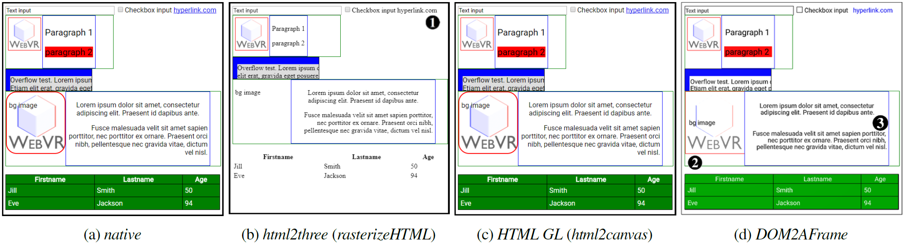

# DOM2AFrame : Putting the Web back in WebVR

This post is about the [DOM2AFrame proof-of-concept library][d2a_github], which **transcodes typical HTML/CSS webpages to WebVR compatible UIs** on-the-fly, while maintaining support for full interaction and animation at good enough&trade; framerates. This fun project has helped us get deeper insights in CSS handling, the browser's rendering pipeline, supported and missing JavaScript APIs and the performance of WebGL. 

Some of the main takeaways:
- WebGL is amazingly fast and even relatively unoptimized code can get you good results 
- JavaScript cannot (easily) capture all state changes on a webpage (and MutationObserver isn't fantastic in this regard)
- CSS overflow:hidden and browser font rendering are magical things 
- TODO

TODO: add sander's repo to the README of my repo 

[d2a_github]: https://github.com/rmarx/DOM2AFrame

## Browsing the Web in VR 

For my PhD in web performance, I had primarily been looking into network performance, with HTTP/2 and QUIC. 
However, browser-side performance also matters a lot and together with bachelor student [Sander Vanhove][lamasaurus], we wanted to do something with the hot new kid on the block: [WebVR][webvrrocks]! The topic clickly turned into the question **(How) can we render webpages in 3D/VR**? And related: can we create UIs for games/3D experiences in plain HTML/CSS/JS? 

[lamasaurus]: https://github.com/Lamasaurus
[webvrrocks]: https://webvr.rocks/

It quickly became apparent that while some modern browsers do offer a _browse in VR_ option, this is often limited. As can be seen in the video below, they usually just map the page onto a very narrow ~2D plane, acting like a floating screen/window in the 3D space. There is no immersion or depth, and worst of all: content specifically made for VR (like 360&deg; videos) isn't automatically integrated. 

** TODO : YOUTUBE VIDEO ** 

Additionally, here is also nothing developers can do about this (yet): while CSS supports various 3D-related properties, there is no CSS media-query for VR that would allow us to make a vr-version of a site (though support for this type of thing [is being worked on][custom-media-queries]). Even then, browsers would need additional directives to allow a full integration.  

[custom-media-queries]: https://drafts.csswg.org/mediaqueries-5/#script-custom-mq

WebVR itself also can't help us here directly: it primarily acts as a layer between the various Virtual Reality hardware setups and the 3D/WebGL capabilities of the HTML `<canvas>` element. This means we can build [fully immersive, VR-ready 3D experiences][webvrexamples], but that we **have to use lower-level tech like shaders, 3D objects and raycasting, instead of our beloved HTML/CSS/.onclick**. For many, this would mean investing in a new skillset or even hiring new engineers to create a VR webpage and then they would still be stuck having to maintain two very different codebases. 

So we set out to find a way to **render standard HTML/CSS webpages into a 3D/VR context**. 

[comment]: <> (Luckily, there is another standard in the works that might help with this: [WebVR][webvrrocks]. WebVR acts as a layer between the various Virtual Reality hardware setups and the 3D/WebGL capabilities of the HTML `<canvas>` element. Using these building blocks, we can indeed build a [fully immersive, VR-ready experience][webvrexamples]. The main problem is: **we cannot build this using our known tools of HTML, CSS and things like JavaScript click events**. Instead, we have to resort to the ever so slightly more complex shaders, 3D objects and raycasting: no more flexbox or rounded corners for you! This would result in having to maintain two very diverse versions of a website instead of a single codebase with specific directives per platform (as is the case with most mobile websites today). You would also possibly have to hire a different type of engineer to create this version.)

[webvrexamples]: https://medium.com/samsung-internet-dev/eleven-examples-of-how-webvr-is-being-used-today-cbcb214b816c

## Render HTML to a Texture

A basic approach to our problem would be to render individual elements/containers (the menu, hero image, contact form, ...) to a 2D texture and then map those on separate 3D elements/quads. A pseudocode API for this could like something like in Figure 1. 

[comment]: <> (A basic approach to our problem would be to first render the page to a 2D texture, and then map that texture onto a 3D object. If we create multiple 2D textures per page (e.g., one for the menu, one for the hero image, one for the contact form, etc.) and map them on separate 3D elements, we can transform them individually. Pseudocode could look something like this:)

Figure 1: Rasterization API example (Bullet template from [spyropress][spyropress])

[spyropress]: http://spyropress.com/themes/bullet-multipurpose-vertical-menu-wp-theme.html

Sadly, as it turns out, this type of _rasterization_ API is not available in JavaScript. The reasons for this are not fully clear to me (as this should be quite do-able, if non-trivial, to provide for browsers), but [the best reference I have found cites mainly security concerns][rasterize_security]. For example, Firefox does have something similar, but [you can only use it in privileged Firefox contexts][ff_rasterize] (what MDN refers to as chrome :)).

[ff_rasterize]: https://developer.mozilla.org/en-US/docs/Web/API/CanvasRenderingContext2D/drawWindow
[rasterize_security]: http://robert.ocallahan.org/2011/09/risks-of-exposing-web-page-pixel-data.html

Luckily, as usual, we were not the only ones thinking of this type of functionality. It turned out other people had already cracked this problem, using two very different workarounds! 

### Workaround 1: The `<foreignObject>` tag

The first method uses the obscure `<foreignObject>` [tag][foreignObject_spec] of the Scalable Vector Graphis (SVG) format. Any HTML content placed within this tag will be rendered as if it was a normal page and then the result is injected back into the SVG. If we subsequently render the SVG to a texture with the existing `<canvas>` APIs, we can use it in 3D as well! 

However, again due to security considerations, links to external resources (e.g., CSS, JS) are not supported so these need to be inlined/copied and images need to be base64 encoded. Das Surma has [a good write-up][dom2texture] on this method and the most mature library we have found that does this is [rasterizeHTML][rasterizeHTML].

Getting these textures into 3D is then [relatively straightforward][dom2texture2canvas], but adding interaction with the 3D result is a bit more involved. A good approach is to just let the underlying DOM version of the page handle the intricacies and "simply" re-render the updated elements when needed. To alert the DOM that something happened, we can for example map mouse coordinates to texture UV coordinates and then use those through [document.elementFromPoint] to find the associated DOM element. Using [MutationObservers][mutationObserver] we can then trigger an appropriate re-render. [HTML2Three][html2three] is a nice POC implementation of these concepts that uses [rasterizeHTML][rasterizeHTML] interally.

You can see the results of this method using the rasterizeHTML and HTML2Three libraries on our testsite in Figure TODO. Note that it is possible to get better results, but this requires substantially more setup and overhead.   

[foreignObject_spec]: https://developer.mozilla.org/en-US/docs/Web/SVG/Element/foreignObject
[dom2texture]: http://dassur.ma/things/dom2texture/
[dom2texture2canvas]: http://dassur.ma/things/dom2texture/#step-2-drawing-it-to-canvas
[rasterizeHTML]: https://cburgmer.github.io/rasterizeHTML.js/ 
[html2three]: https://github.com/marciot/html2three
[elementFromPoint]: https://developer.mozilla.org/en-US/docs/Web/API/Document/elementFromPoint
[mutationObserver]: https://developer.mozilla.org/en-US/docs/Web/API/MutationObserver

### Workaround 2: Re-invent the browser's rendering implementation

This method sounds a bit crazy: instead of letting the browser render the HTML/CSS, let's write a custom renderer and draw the elements to a texture ourselves! This is possible because the `<canvas>` element also provides a mature and extensive [2D drawing API][context2D]. It is also possible because we can use JavaScript to obtain the results of the browser's "layouting" calculations and _only_ need to re-implement the actual "styling/painting" logic, see Figure 2. For example, the results of complex positioning setups, such as with flexbox, can be queried using [`getBoundingClientRect`][getBoundingClientRect]. Other results of CSS parsing are available using [`getComputedStyle`][getComputedStyle]. 

[context2D]: https://developer.mozilla.org/en-US/docs/Web/API/CanvasRenderingContext2D
[getBoundingClientRect]: https://developer.mozilla.org/en-US/docs/Web/API/Element/getBoundingClientRect
[getComputedStyle]: https://developer.mozilla.org/en-US/docs/Web/API/Window/getComputedStyle

Figure 2: CSS layouting and styling (simplified: CSS obviously does a lot more)

Still, even "only" implementing this part is quite daunting, though it can make for an [interesting learning experience][kosamari]. We decided to use the excellent [HTML2Canvas][html2canvas] library, which is able to get extremely impressive results (almost picture perfect) in our tests, see Figure TODO. 

[html2canvas]: https://html2canvas.hertzen.com/
[kosamari]: https://twitter.com/kosamari/status/930558641706500097

Since the end-result of this method is very similar to Workaround 1 (2D textures), the way we deal with user input and updates is also similar. The [HTML-GL][htmlgl] library wraps [HTML2Canvas][html2canvas] (and is in the progress of supporting other "backends") to support 3D. 

[htmlgl]: https://github.com/PixelsCommander/HTML-GL

Figure TODO: Method comparison for three methods (b-d) and the browser's ground truth (a)

### Performance problems

So, great! In [HTML2Canvas][html2canvas] we have found an excellent renderer! Now we just need to use it on our individual elements and done! Sadly, this is a post (at least partly) about performance and we haven't talked about performance yet... 

As it turns out, neither of the two workarounds offer satisfactory performance. 

TODO this is why both 3D libs take differing approaches 
	-> GL is similar to the browser's layering 
TODO to be fair: were not made with performance / repainting in mind... but doesn't change the problem 

## Transcode HTML to 3D objects and shaders 

---
**Thanks to Sander Vanhove and Wouter Vanmontfort for working with me on this topic.**

https://webvr.edm.uhasselt.be 

Last update: 04/12/2017  
Live version: https://github.com/rmarx/DOM2AFrame-perfcal17